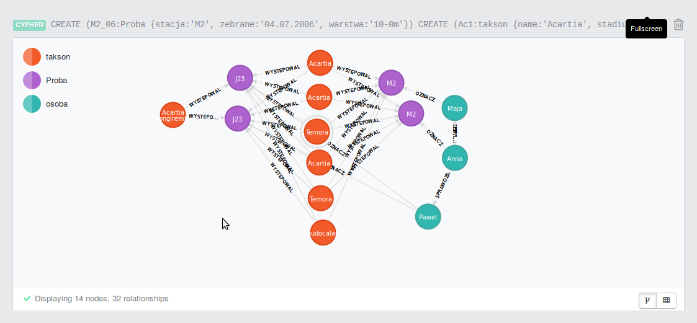
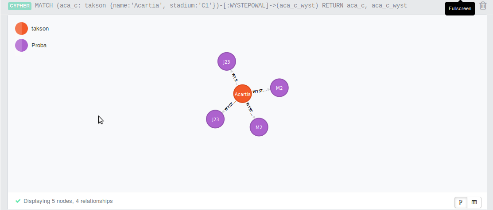

Neo4j-zal
=========

zadanie z Neo4j
Poniżej moja baza w której wykorzystałem część danych na których pracuję



Poniżej przykładowe polecenia tworzące elementy bazy

CREATE (M2_06:Proba {stacja:'M2', zebrane:'04.07.2006', warstwa:'10-0m'})
CREATE (Pn:takson {name:'Pseudocalanus', stadium:'N'})

Oraz relacje

CREATE (Ac1)-[:WYSTEPOWAL {licz:[607]}]->(M2_06)
```
CREATE (M2_06:Proba {stacja:'M2', zebrane:'04.07.2006', warstwa:'10-0m'})
CREATE (Ac1:takson {name:'Acartia', stadium:'C1'})
CREATE (An:takson {name:'Acartia', stadium:'N'})
CREATE (T1:takson {name:'Temora', stadium:'C1'})
CREATE (T2:takson {name:'Temora', stadium:'C2'})
CREATE (Pn:takson {name:'Pseudocalanus', stadium:'N'})
CREATE (Alsa:takson {name:'Acartia longiremis', stadium:'sa'})
CREATE (Ac2:takson {name:'Acartia', stadium:'C2'})
CREATE
(Ac1)-[:WYSTEPOWAL {licz:[607]}]->(M2_06),
(An)-[:WYSTEPOWAL {licz:[2369]}]->(M2_06),
(T1)-[:WYSTEPOWAL {licz:[862]}]->(M2_06),
(T2)-[:WYSTEPOWAL {licz:[413]}]->(M2_06),
(Pn)-[:WYSTEPOWAL {licz:[36]}]->(M2_06),
(Ac2)-[:WYSTEPOWAL {licz:[364]}]->(M2_06)
CREATE (M2_07:Proba {stacja:'M2', zebrane:'04.07.2006', warstwa:'10-0m'})
CREATE
(Ac1)-[:WYSTEPOWAL {licz:[822]}]->(M2_07),
(An)-[:WYSTEPOWAL {licz:[5716]}]->(M2_07),
(T1)-[:WYSTEPOWAL {licz:[4]}]->(M2_07),
(T2)-[:WYSTEPOWAL {licz:[2]}]->(M2_07),
(Ac2)-[:WYSTEPOWAL {licz:[680]}]->(M2_07)
CREATE (J23_06_1:Proba {stacja:'J23', zebrane:'12.06.2006', warstwa:'10-0m'})
CREATE
(Ac1)-[:WYSTEPOWAL {licz:[931]}]->(J23_06_1),
(An)-[:WYSTEPOWAL {licz:[2015]}]->(J23_06_1),
(T1)-[:WYSTEPOWAL {licz:[1404]}]->(J23_06_1),
(T2)-[:WYSTEPOWAL {licz:[351]}]->(J23_06_1),
(Pn)-[:WYSTEPOWAL {licz:[46]}]->(J23_06_1),
(Alsa)-[:WYSTEPOWAL {licz:[61]}]->(J23_06_1),
(Ac2)-[:WYSTEPOWAL {licz:[321]}]->(J23_06_1)
CREATE (J23_06_2:Proba {stacja:'J23', zebrane:'12.06.2006', warstwa:'20-10m'})
CREATE
(Ac1)-[:WYSTEPOWAL {licz:[1222]}]->(J23_06_2),
(An)-[:WYSTEPOWAL {licz:[3593]}]->(J23_06_2),
(T1)-[:WYSTEPOWAL {licz:[3988]}]->(J23_06_2),
(T2)-[:WYSTEPOWAL {licz:[862]}]->(J23_06_2),
(Pn)-[:WYSTEPOWAL {licz:[72]}]->(J23_06_2),
(Alsa)-[:WYSTEPOWAL {licz:[72]}]->(J23_06_2),
(Ac2)-[:WYSTEPOWAL {licz:[467]}]->(J23_06_2)
CREATE (MMK:osoba {name:'Maja'})
CREATE (PM:osoba {name:'Pawel'})
CREATE (AL:osoba {name:'Anna'})
CREATE
(AL)-[:SPRAWDZIL]->(PM),
(MMK)-[:SPRAWDZIL]->(AL),
(AL)-[:SPRAWDZIL]->(MMK)
CREATE
(MMK)-[:OZNACZ {wykonal:'22.01.2007'}]->(M2_06),
(PM)-[:OZNACZ {wykonal:'14.03.2010'}]->(J23_06_1),
(PM)-[:OZNACZ {wykonal:'15.03.2010'}]->(J23_06_2),
(AL)-[:OZNACZ {wykonal:'23.02.2008'}]->(M2_07)
RETURN *
;
```
Przykładowe łączenie

MATCH (aca_c: takson {name:'Acartia', stadium:'C1'})-[:WYSTEPOWAL]->(aca_c_wyst) RETURN aca_c, aca_c_wyst


